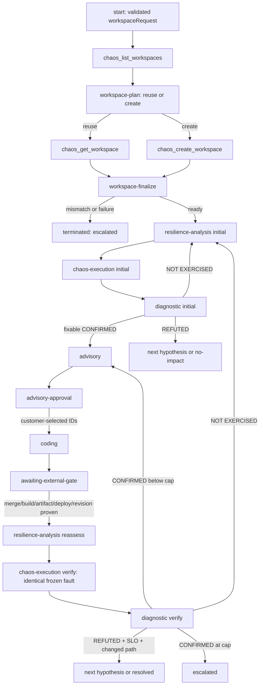

# Chaos Loop

Chaos Loop is a single-controller GitHub Copilot CLI plugin for evidence-gated
Azure Chaos Studio resilience remediation. It runs one falsifiable hypothesis
and one matching fault at a time and preserves a durable evidence envelope.
The normal flow has exactly two customer interaction stops: advisory selection,
then PR delivery while awaiting the hard external merge/deploy gate.

The controller is the only public entry point. Five phase skills provide
strictly bounded work and never invoke agents, the controller, or one another.

## Install

```bash
copilot plugin marketplace add microsoft/chaos-studio
copilot plugin install startchaos@chaos-studio
```

Local development from this repository:

```powershell
copilot --plugin-dir .\copilot-cli-plugin
```

After unpacking the standalone archive:

```powershell
copilot --plugin-dir .\chaos-loop
```

### Build the distributable archive

From the repository root:

```powershell
pwsh -NoProfile -File .\copilot-cli-plugin\scripts\Build-ChaosLoopPackage.ps1
```

The repository-native package is written to:

`tmp/chaos-loop-package/chaos-loop-1.0.0.zip`

The builder stages the full plugin, rejects local/development references and
bytecode, loads the staged plugin through Copilot CLI, verifies archive
contents, and writes a SHA-256 package report beside the archive.

For Azure SRE Agent, unpack the same archive and follow
[`sre-agent-chaos-loop-import.md`](sre-agent-chaos-loop-import.md). Current
project documentation requires portal configuration of the state tool, MCP
connector, identity, and skills; those authenticated UI steps remain manual.

## Prerequisites

- Python 3.10 or later.
- Azure authentication through the bundled `chaos-studio` MCP server using
  managed identity or `az login`.
- Permission to list `Microsoft.Chaos/workspaces` in the requested
  subscription, plus permission to create one (and assign Reader on the
  requested managed scopes) when no compatible workspace exists.
- A Chaos Studio v2 workspace with discovered recommendations — reused when one
  already fits the request, otherwise created by preflight.
- One existing, permission-ready, validated Scenario configuration.
- Read access to deployment/revision identity and telemetry sources.
- Write permission for the selected Scenario only.
- Repository permissions needed by Coding to create branches and PRs.

The plugin uses the repository's bundled `chaos-studio` MCP server for Chaos
Studio v2 and Azure Monitor operations. It does not duplicate those wrappers or
rely on source files outside the installed plugin.

## Usage

### Start

```text
/chaos-loop start repo=contoso/orders commit=abc123 \
  target_resources=["/subscriptions/<sub>/resourceGroups/rg-orders/providers/Microsoft.Web/sites/orders"] \
  workspace_request={"subscriptionId":"<sub>","resourceGroup":"rg-orders","location":"eastus","managedScopes":["/subscriptions/<sub>/resourceGroups/rg-orders"]} \
  guardrails={"environmentScope":"staging","blastRadiusCap":"one replica","safetyHalts":["availability below 95% for 2m"]} \
  max_iterations=3
```

`workspace_request` is required. It is normalized and validated at start:
subscription UUID, Azure-safe resource group, region, non-empty managed scopes
(subscription, resource-group, or resource ARM IDs, all in the requested
subscription), optional `preferredName`, and optional `identity`
(`SystemAssigned` by default; `UserAssigned` requires the exact
`userAssignedIdentityResourceId`). Every target resource must be a valid ARM ID
in the same subscription and covered by a requested managed scope. Anything
ambiguous or unsupported fails closed before any phase runs.

Run state is created at:

`tmp/chaos-loop/runs/<runId>/state.json`

### Workspace preflight

The controller resolves exactly one Chaos Studio workspace before analysis,
without asking a mid-loop question:

1. `chaos_list_workspaces` enumerates existing workspaces (subscription or
   resource-group scope, ARM paging included).
2. `workspace-plan` deterministically decides reuse versus create and writes a
   stamped plan without mutating state.
3. The controller reads back the reused workspace with `chaos_get_workspace`,
   or creates the planned workspace with `chaos_create_workspace` (a write, so
   tool approval stays on).
4. `workspace-finalize` proves the result and persists the ready workspace.

```powershell
python <plugin-root>\scripts\chaos_loop_state.py workspace-plan `
  --state <state.json> --expected-revision 0 `
  --discovery <chaos_list_workspaces result.json> `
  --observed-at 2026-08-14T10:00:00Z `
  --output <workspace-plan.json>

python <plugin-root>\scripts\chaos_loop_state.py workspace-finalize `
  --state <state.json> --expected-revision 0 `
  --plan <workspace-plan.json> `
  --result <chaos_get_workspace or chaos_create_workspace result.json>
```

Compatibility requires the requested region, the requested identity when one is
pinned, `provisioningState = Succeeded`, and managed scopes that cover both the
requested scopes and every target resource. Selection precedence is exact
preferred name, then exact managed-scope set, then stable case-insensitive ARM
ID; the remaining compatible workspaces are recorded as alternatives with a
caveat. With no compatible candidate the create request uses `preferredName` or
a deterministic `chaos-loop-<hash>` name plus exactly the requested scopes,
region, and identity.

A failed list/get/create call is recorded with:

```powershell
python <plugin-root>\scripts\chaos_loop_state.py workspace-fail `
  --state <state.json> --expected-revision 0 `
  --stage list --result <raw tool result.json>
```

Any tool failure, failed RBAC grant, non-`Succeeded` provisioning, or readback
mismatch persists `workspace.status = failed` with a concrete
`remediationBrief` and terminates the run `escalated`. Only a ready workspace
lets `resilience-analysis` start, and the selected workspace is immutable for
the rest of the run — later phases reuse it and never rediscover.

The controller automatically advances every decisive phase handoff until
`advisory-approval`, `awaiting-external-gate`, or a terminal state.

### Status

```text
/chaos-loop status run_id=<runId>
```

Status is read-only and reports the revision, phase, selected hypothesis/fault,
iteration cap, transition, verdict, and unresolved caveats.

### Resume after advisory approval

```text
/chaos-loop resume run_id=<runId> approved_advisory_ids=A1,A2
```

Only IDs in the current proposed set are accepted. Advisory shows a ranked set
and `defaultRecommendedAdvisoryIds`; approval is never inferred. Once selected,
Coding runs automatically.

### Resume after external merge and deploy

Create a payload matching `schemas/chaos-loop/external-gate.v1.schema.json`:

```json
{
  "schemaVersion": "chaos-loop-gate/v1",
  "runId": "5e9aa5cf-15e6-4511-9025-9340c89d0d96",
  "expectedStateRevision": 6,
  "changes": [
    {
      "changeId": "C1",
      "prUrl": "https://github.com/contoso/orders/pull/42",
      "mergeCommit": "0123456789abcdef0123456789abcdef01234567",
      "targetEnv": "staging",
      "expectedBuildId": "build-8421",
      "observedBuildId": "build-8421",
      "expectedArtifact": "sha256:abc123",
      "observedArtifact": "sha256:abc123",
      "expectedDeploymentId": "deploy-771",
      "observedDeploymentId": "deploy-771",
      "expectedRevision": "orders--000042",
      "observedRevision": "orders--000042",
      "live": true,
      "evidence": [
        {
          "stage": "merge",
          "name": "PR merge commit",
          "source": "GitHub pull request 42",
          "observedAt": "2026-08-13T20:00:00Z",
          "value": "0123456789abcdef0123456789abcdef01234567"
        },
        {
          "stage": "build",
          "name": "Build source version",
          "source": "Azure Pipelines build 8421",
          "observedAt": "2026-08-13T20:05:00Z",
          "value": "build-8421 source 0123456789abcdef0123456789abcdef01234567"
        },
        {
          "stage": "artifact",
          "name": "Published artifact digest",
          "source": "Container registry manifest",
          "observedAt": "2026-08-13T20:07:00Z",
          "value": "sha256:abc123"
        },
        {
          "stage": "deployment",
          "name": "Deployment artifact",
          "source": "Deployment deploy-771",
          "observedAt": "2026-08-13T20:12:00Z",
          "value": "deploy-771 -> sha256:abc123"
        },
        {
          "stage": "serving-revision",
          "name": "Live serving revision",
          "source": "Container Apps revision list",
          "observedAt": "2026-08-13T20:14:00Z",
          "value": "orders--000042"
        }
      ]
    }
  ]
}
```

Resume:

```text
/chaos-loop resume run_id=<runId> gate_payload=tmp/chaos-loop/gate.json
```

The gate validates the full chain:

`merge commit -> build -> artifact -> deployment -> live serving revision`.

Missing or mismatched evidence remains blocked. There is no force/bypass flag.
When accepted, reassessment, identical verify execution, and verify Diagnostic
run automatically. Merge is not deployment; deployment is not changed-path
execution.

## Flow



## State and transitions

- Schema: `schemas/chaos-loop/run-state.v1.schema.json`.
- Workspace plan schema: `schemas/chaos-loop/workspace-plan.v1.schema.json`.
- Contract: `chaos-loop-contract/v1`.
- Policy: `chaos-loop-policy/v2`; earlier policy state is migrated atomically
  and idempotently by the controller. A migrated run has no proven workspace,
  so it is migrated to `workspace.status = pending` and must complete preflight
  (supply the request with `migrate --workspace-request`) before any phase runs.
- Optimistic revision: every mutation requires the exact current revision.
- Persistence: exclusive lock plus atomic same-directory replacement.
- Event log: one UTC event per successful revision.
- Default iteration cap: 3.
- Phase outputs cannot write fields owned by another phase.
- Every phase emits a complete phase-owned `handoff` and one opinionated
  `ready` or `terminated` decision.
- Only `advisory-approval` and `awaiting-external-gate` are valid blocked states.
- `frozenValidation` is canonical and immutable for reassess/verify.
- `workspace.selected` is canonical and immutable after preflight.

Allowed phase transitions are enforced by `scripts/chaos_loop_state.py`, not by
phase prose. `NOT EXERCISED` never reaches Advisory.

## Deterministic policy versus model judgment

`scripts/chaos_loop_state.py` deterministically owns:

- run allocation, schema/policy migration, atomic writes, optimistic revisions,
  idempotency, events, phase ownership, and all routes/terminal states;
- workspace request normalization/validation, candidate compatibility, stable
  reuse-or-create selection, create-request construction, readback/RBAC/
  provisioning verification, and workspace immutability;
- Scenario catalog eligibility, predicate/fault completeness, one-fault
  enforcement, score/ID sorting, and highest-ranked selection;
- canonical frozen-fault equality, build identity equality, steady-state
  aggregation, fault/window/recovery/safety gates;
- numeric and DLQ deltas/ages, null-versus-zero rules, work/path exercise
  eligibility, verdict matrix, and iteration routing;
- advisory eligibility, score ordering, attempted-fix de-duplication, ledger
  diff, default ID, and approval subset;
- Coding coverage/PR/verification policy and the complete external gate chain;
- package manifest, reference, staged-load, and archive validation.

Models are limited to semantic code/IaC risk and evidence extraction, telemetry
mechanism/correlation explanation after factual evaluation, evidence-grounded
advisory drafting, approved code implementation, and review summaries.

Each phase writes a structured proposal, calls:

```powershell
python <plugin-root>\scripts\chaos_loop_state.py evaluate `
  --state <state.json> --expected-revision <revision> --phase <phase> `
  --input <phase-proposal.json> --output <phase-output.json>
```

Only evaluator-stamped output can be applied. Missing/invalid evidence fails
closed with machine-readable JSON and a stable nonzero exit code.

## Phase boundaries

| Skill | Does | Never does |
|---|---|---|
| controller preflight | resolve exactly one workspace (reuse or create) with proof | ask a mid-loop workspace question, rediscover after ready |
| resilience-analysis | highest-ranked eligible hypothesis and one executable test handoff | inject, diagnose, advise, edit |
| chaos-execution | decide Diagnostic eligibility or hand concrete repair to Analysis | SLI math, verdict, advice, success claim |
| diagnostic | exact verdict and automatic evidence-based route | recommend or edit |
| advisory | ranked proposed set, default IDs, ledger, approval handoff | re-diagnose, approve, implement |
| coding | approved-only PRs and complete external-gate handoff | merge, deploy, chaos, resilience claim |
| controller | durable state, routing, approvals, iteration, termination | perform phase work |

Diagnostic and Advisory each perform exactly one bounded critique and one
corrective rewrite. The check is local to that phase; no server critic toggle is
assumed.

## Evidence invariants

- Failure absence is not exercise proof.
- A changed path must be observed during the proven verify fault.
- Eligible-work starvation is checked before low counts.
- Missing numeric data is `null` plus a caveat, never synthetic zero.
- A measured zero retains its query.
- Baselines, units, windows, queries, sources, and DLQ state survive iterations.
- Every timestamp is UTC.
- Build/test can support a PR but cannot prove resilience.

## Safety

- Only one selected hypothesis and one matching fault execute per run.
- Build-live and every mandatory steady-state predicate gate injection.
- Verify rejects Scenario, Action, target, parameter, duration, or blast-radius
  drift.
- A failed exercise is not retried with altered parameters.
- Correctable guardrail/mechanical failure routes to Analysis with a repair
  brief; unsafe/unrecoverable failure terminates `escalated`.
- Hosted runners are treated as disabled.

## Terminal states

| Reason | Meaning |
|---|---|
| `analysis-only` | static analysis accepted; chaos explicitly declined |
| `no-impact` | initial hypothesis refuted under proven exercise; no backlog |
| `no-remediation` | confirmed impact has no safe evidence-supported change |
| `resolved` | identical verify fault refuted hypothesis, SLO held, changed path ran |
| `escalated` | iteration cap or required proof/safety chain cannot be established |

## Files

- `skills/chaos-loop/SKILL.md`: public controller.
- `skills/*/SKILL.md`: five internal phases.
- `references/chaos-loop/shared-contract.md`: common evidence/state rules.
- `references/chaos-loop/scenario-catalog.md`: supported Scenario eligibility grounding.
- `scripts/chaos_loop_state.py`: atomic state and transition controller.
- `mcp/`: the existing Chaos Studio/Monitor MCP package used by every phase.
- `scripts/Build-ChaosLoopPackage.ps1`: reproducible validated archive builder.
- `schemas/chaos-loop/*.json`: run-state, workspace-plan, and external-gate
  schemas.
- `docs/sre-agent-chaos-loop-import.md`: Agent Builder import, RBAC, connector,
  and state setup.

## Migration from the old agent chain

This plugin replaces the old Resilience Loop agents-as-tools and
server-managed handoff design. It deliberately removes Agent Builder memory,
SearchMemory, common-prompt attachments, critic toggles, scheduled-task control,
direct `start-chaos -> chaos-impact` routing, and multi-fault execution.

There is no server scheduler. Coding stops at `awaiting-external-gate`; an
external operator or deployment system supplies the explicit gate payload.
Diagnostic/Advisory critique is bounded in their skill contracts. Durable state
is a repository-local run document controlled by optimistic revision and atomic
writes.

## External by design

The plugin does not approve advisories, merge PRs, deploy artifacts, invent
deployment identity, or generate changed-path telemetry. Those proofs come from
the responsible human/system and are validated on resume. Azure access and
Scenario configuration remain environment prerequisites.
